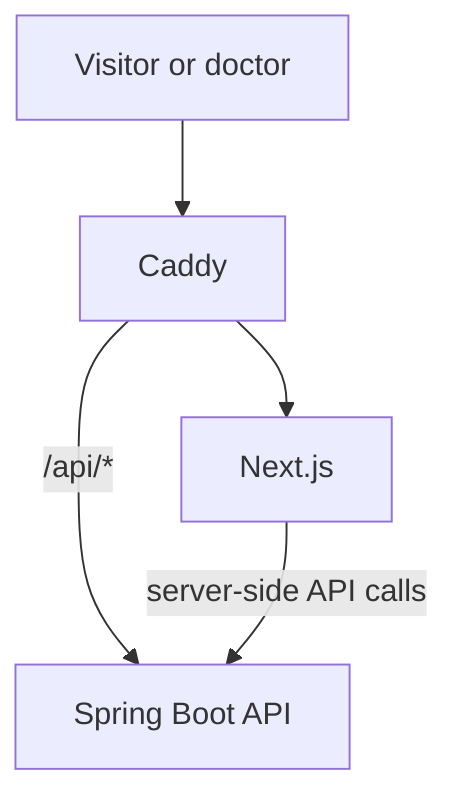

# Medical web system context

The Next.js application presents public doctor profiles and future provider/admin interfaces. Public pages are server-rendered and retrieve authoritative data through the generated API client.

The frontend owns presentation, metadata, accessibility, and interaction. The API owns business rules and authorization. The frontend never connects to PostgreSQL, R2, or Resend directly.

A future trades product receives a separate frontend repository and brand. Shared UI code is extracted only after real duplication is demonstrated.
