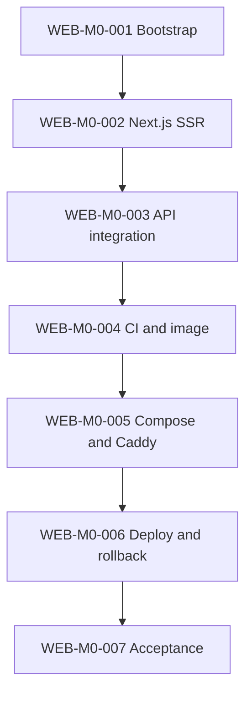

# Web Milestone 0 Backlog — Frontend and public-edge foundation

- **Goal:** Produce an independently buildable and deployable Next.js SSR frontend with exact API integration and one safe public Caddy entry point.
- **Feature scope:** No doctor profiles, authentication, appointment requests, or trades UI.
- **Repository:** `professional-services-medical-web` only.

## Dependency graph

`WEB-M0-003` also depends on API-M0-005 generation and verified registry publication from API-M0-006. `WEB-M0-005` integration validation depends on API-M0-007.

## Ordered backlog

| Task | Outcome | Dependencies |
|---|---|---|
| WEB-M0-001 | Repository, toolchain, governance, and base files | None |
| WEB-M0-002 | Next.js SSR, strict TypeScript, health, and test baseline | WEB-M0-001 |
| WEB-M0-003 | Exact generated-client status integration | WEB-M0-002, API-M0-005, verified API-M0-006 registry publication |
| WEB-M0-004 | CI, security gates, E2E, immutable web image | WEB-M0-003 |
| WEB-M0-005 | Production web Compose, Caddy, edge network, routing tests | WEB-M0-004, API-M0-007 |
| WEB-M0-006 | Protected web deployment and rollback | WEB-M0-005 |
| WEB-M0-007 | Clean-room frontend and cross-repository acceptance | WEB-M0-006 |

## Cross-repository gates

- The web waits for an explicitly published API-client package; it never copies generated source from an API working tree.
- The API is deployed first for any additive endpoint required by a new web release.
- Caddy integration tests select a specific healthy API image/release.
- Web rollback never changes the API, PostgreSQL, or Flyway history.

## Safe parallel work

- WEB-M0-001 and API-M0-001 may run in parallel.
- WEB-M0-002 may proceed while the API client is being prepared.
- WEB-M0-003 waits for API-M0-005 and verified API-M0-006 registry publication.
- WEB-M0-005 waits for the API edge-network contract from API-M0-007.
- Only one task at a time may change Caddy or production web deployment.

## Milestone acceptance

- [ ] Repository initializes and verifies from a clean checkout.
- [ ] Agent, Claude, and Copilot instructions exist and agree.
- [ ] Public baseline is server rendered, accessible, and buildable.
- [ ] Exact generated client integration succeeds without duplicate DTOs.
- [ ] CI covers lint, types, tests, build, E2E, security, and client-version policy.
- [ ] Web image is non-root and tagged by full commit SHA.
- [ ] Caddy is the only public HTTP entry point.
- [ ] `/api/*` routing preserves the path and reaches only the API alias.
- [ ] Web deploy and rollback require protected manual approval.
- [ ] No backend source, database credentials, real personal data, or floating version exists.
- [ ] Human owner approves transition to Milestone 1.
